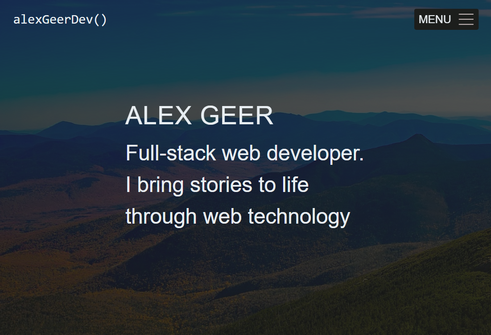
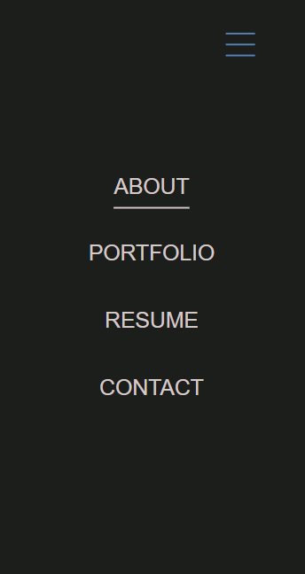
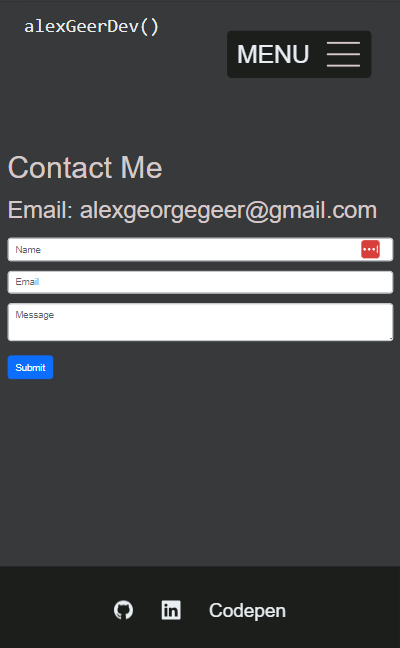
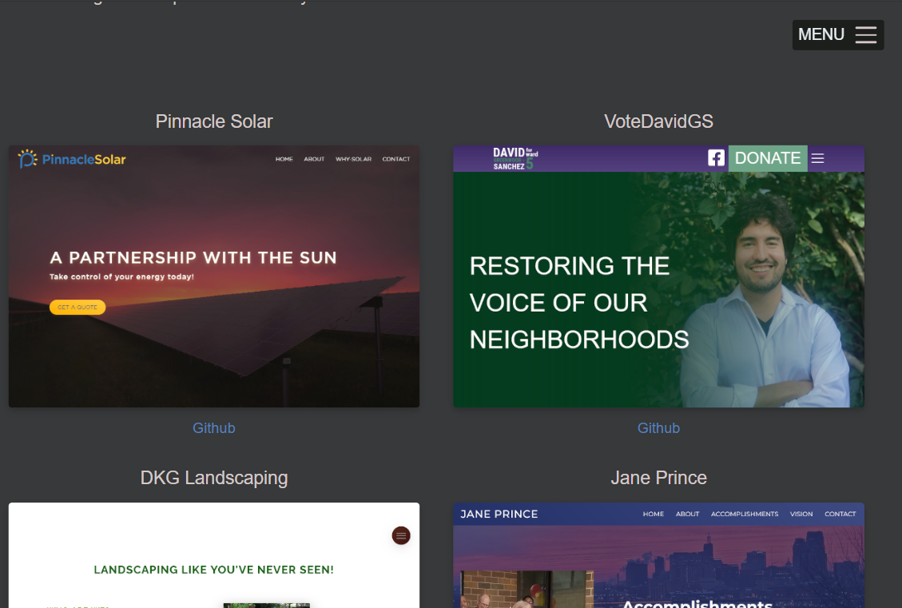

# React Portfolio

## [See the site on Netlify](https://alexgeer.netlify.app/)

## Description

A professional portfolio built with react to showcase my work and allow others to download my resume and/or contact me. This site is a work in progress. Check back for improvements.

## Screenshots

## Questions

Github: [ag-bootcamp-umn](https://github.com/ag-bootcamp-umn)

## License

Licensed under the [MIT](https://opensource.org/license/mit/) license.
